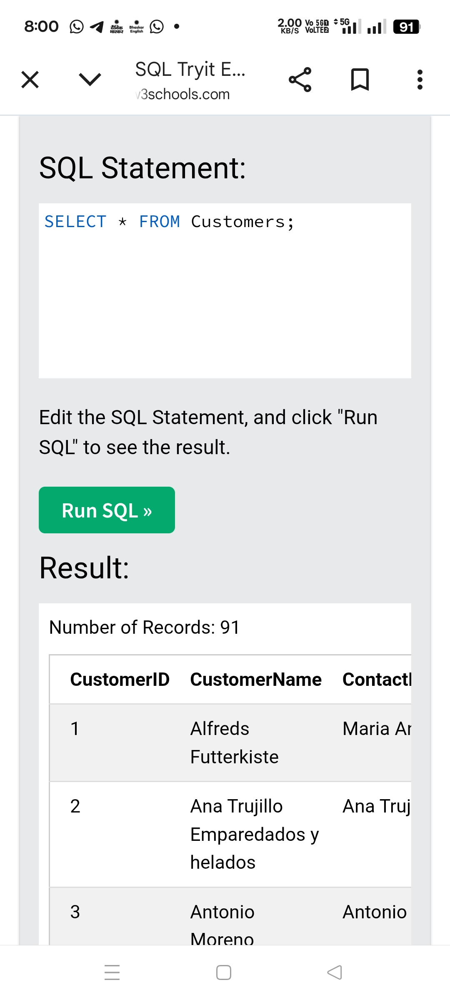

# Lesson 01 – SELECT, WHERE, ORDER BY

## 1. Select all records
```sql
SELECT * FROM Customers;
```
Purpose: View complete table data.
📷 Screenshot:  

2. Filter using WHERE
```sql
SELECT * FROM Customers
WHERE Country = 'Germany';
```
Purpose: Filter rows based on condition.
📷 Screenshot: screenshots/
screenshots/01_where_germany.png
3. AND condition with LIKE
```sql
SELECT * FROM Customers
WHERE Country = 'Germany'
AND CustomerName LIKE 'B%';
```
Purpose: Multiple conditions + pattern matching.
📷 Screenshot: screenshots/01_and_like.png
4. OR condition
```sql
SELECT * FROM Customers
WHERE Country = 'Germany'
OR Country = 'Mexico';
```
📷 Screenshot: screensh
ots/01_or_condition.png
5. NOT condition
```sql
SELECT * FROM Customers
WHERE NOT Country = 'Germany';
```
📷 Screenshot: screenshots/01_not_condition.png
6. ORDER BY (Ascending)
```sql
SELECT * FROM Customers
ORDER BY CustomerName;
```
📷 Screenshot: screenshots/01_orderby_asc.png
7. ORDER BY (Descending)
```sql
SELECT * FROM Customers
ORDER BY CustomerName DESC;
```
📷 Screenshot: screenshots/01_orderby_desc.png
