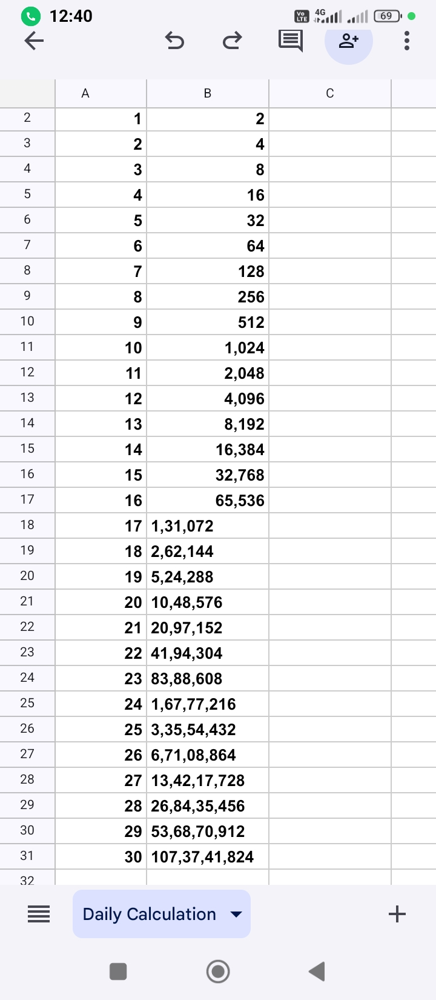

🔹 Mini Recap: What You’ve Learned Today (Day 1)

Concept	Example	Meaning

SELECT *	SELECT * FROM Customers;	Select all columns
WHERE	WHERE Country = 'Germany'	Filter rows based on a condition
<>	WHERE Country <> 'Germany'	Not equal to
LIKE	WHERE CustomerName LIKE 'B%'	Matches pattern (starts with B)
'' (quotes)	'Germany', 'B%', 'Anders'	Always use single quotes for text values.

Amazing! Here's your Day 2: Filtering + Sorting learning summary — clean, structured, and ready to save 👇

---

✅ SQL – Day 2 Summary: Filtering + Sorting

🔹 1. Logical Operators

➤ AND – All conditions must be true

SELECT * 
FROM Customers
WHERE Country = 'Germany' AND CustomerName LIKE 'B%';

➤ OR – At least one condition must be true

SELECT * 
FROM Customers
WHERE Country = 'Germany' OR Country = 'Mexico';

➤ NOT – Negates the condition

SELECT * 
FROM Customers
WHERE NOT Country = 'Germany';

(Also same as Country <> 'Germany')

---

🔹 2. Sorting with ORDER BY

➤ Sort in ascending order (default)

SELECT * 
FROM Customers
ORDER BY CustomerName;

➤ Sort in descending order

SELECT * 
FROM Customers
ORDER BY CustomerName DESC;

➤ Sort by multiple columns

SELECT * 
FROM Customers
ORDER BY Country ASC, CustomerName DESC;

---

🔹 3. Limiting Results (W3Schools / Access Syntax)

➤ Show top 5 rows:

SELECT TOP 5 * 
FROM Customers;

➤ Top 5 sorted by country:

SELECT TOP 5 * 
FROM Customers
ORDER BY Country ASC;

🧠 Note:

Use TOP in W3Schools (Microsoft Access)

Use LIMIT in MySQL / SQLite:

SELECT * FROM Customers LIMIT 5;

