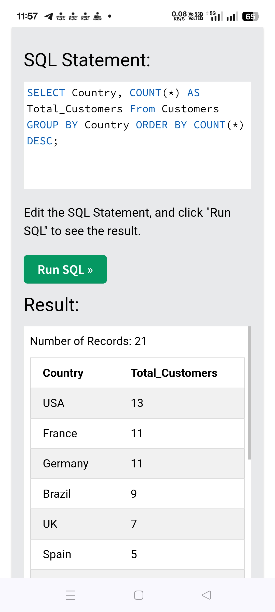

# 📊 SQL Report – Country-wise Customer Count

## Client Question
How many customers are there in each country?

---

## SQL Query

```sql
SELECT 
    Country,
    COUNT(*) AS Total_Customers
FROM Customers
GROUP BY Country
ORDER BY COUNT(*) DESC;
```

Result Preview



## Business Value

Identifies strong and weak markets
Helps in regional sales planning
Useful for reporting and dashboards

## Deliverable

Aggregated country-level summary
Client-readable output
Ready for Excel / CSV reporting
