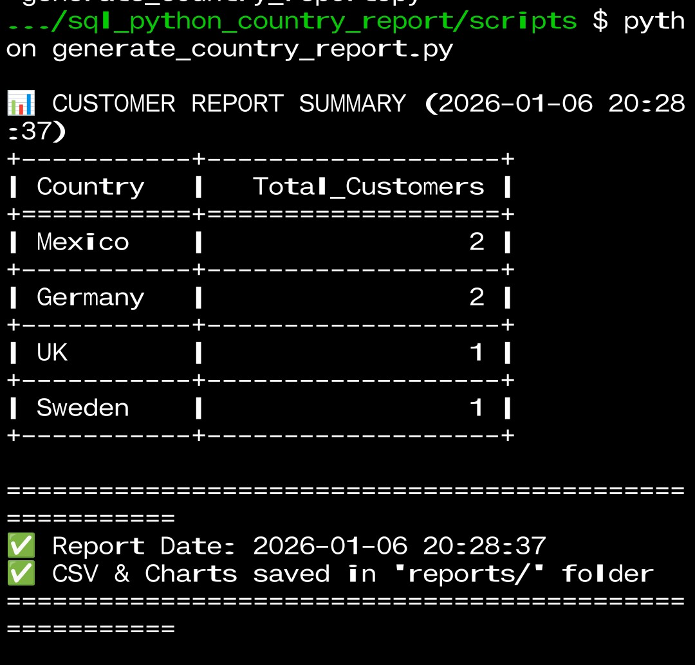
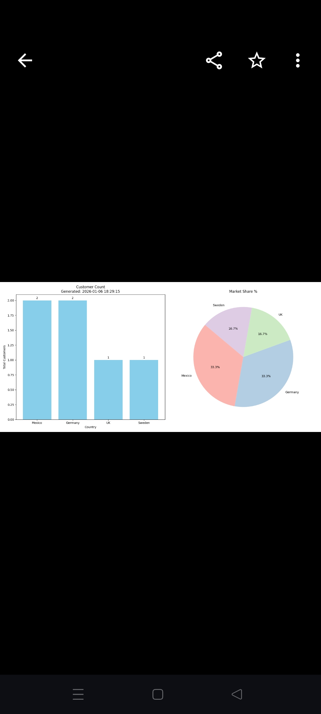
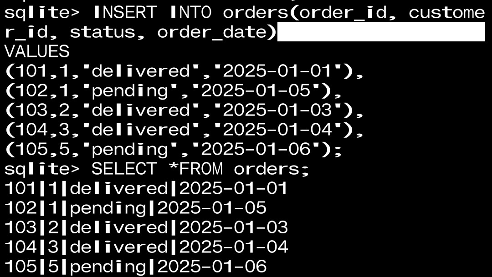
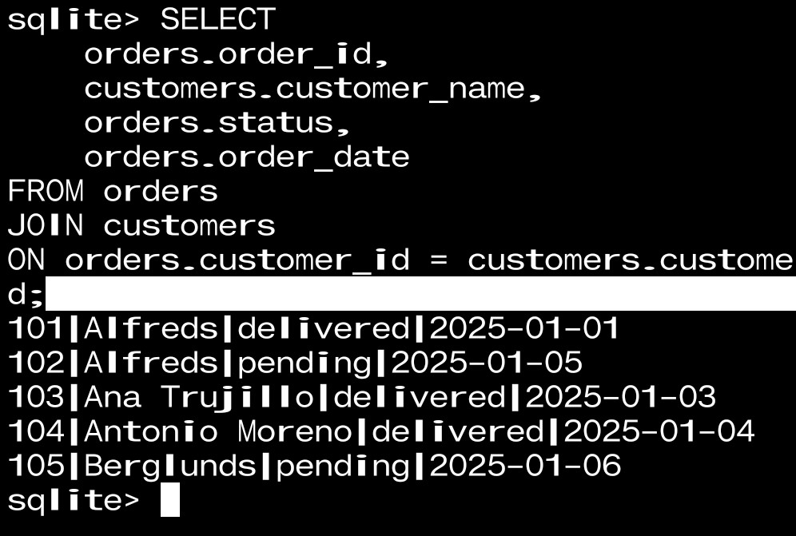
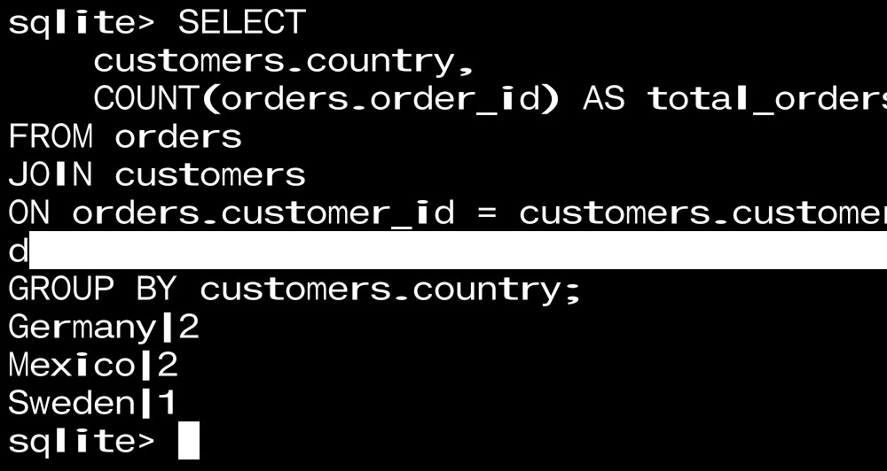

# 📸 Screenshots — Country-wise Customer Analytics Report

This file contains visual proof of execution and deliverables generated by the project

python generate_country_report.py

🖥️ Terminal Output Preview

📄 CSV Report Preview

📊 Charts Preview

Pie Chart — Market Share Distribution

### customers.db

Orders Table Created

 Orders Data Inserted

Customers Orders Table

### JOIN Error & Fix
- Error: no such column: customers.name
- Reason: actual column name is customer_name
- Fix
- ## Orders with Customer Names
- Used JOIN between orders and customers
- Retrieved order status with customer details
(screenshot) corrected JOIN query
- 
- ✅ Step 1: Orders + Customer name (FIRST JOIN)

- ✅ Step 2: Country-wise customers (easy join)
- 👉 सवाल:
किस country से कितने orders आए?

✅ Step 3: Delivered vs Pending orders
👉 Client पूछता है:
कितने orders pending

✅ Step 4: Customers जिनके 2+ orders हैं (important)

✅ Notes
All outputs are auto-generated by the script

No manual editing of CSV or charts
Screenshots are taken directly after execution
